<!-- ═══════════════════════ HERO SCREEN ═══════════════════════ -->

<div align="center">




<br/>


<br/><br/>

> **CURRENT MISSION**
> Building scalable software, enterprise systems, and cybersecurity solutions
> while continuously improving as a developer.

<br/>

[](https://github.com/Mart271)
[](https://www.linkedin.com/in/mark-tagab-25799218b/)
[](mailto:marktagab0@gmail.com)
&nbsp;


</div>


<!-- ═══════════════════════ SYSTEM STATUS ═══════════════════════ -->

## `◢` SYSTEM STATUS

<table width="100%">
<tr>
<td width="50%" valign="top">

### 🎯 Current Focus

| Module | State |
|:--|:--|
| Backend Development | `● ACTIVE` |
| Cybersecurity | `● ACTIVE` |
| Machine Learning | `● ACTIVE` |
| Enterprise Applications | `● ACTIVE` |

</td>
<td width="50%" valign="top">

### 📡 Currently Learning

```text
NestJS      ████████░░   loading…
TypeScript  ████████░░   loading…
React       ███████░░░   loading…
Docker      ██████░░░░   loading…
PostgreSQL  ██████░░░░   loading…
Redis       █████░░░░░   loading…
Flutter     █████░░░░░   loading…
Kotlin      █████░░░░░   loading…
```

</td>
</tr>
</table>


<!-- ═══════════════════════ PROFILE ═══════════════════════ -->

## `◢` PROFILE

I'm Mark, a Computer Science student who builds software that has to survive contact with real users — workforce platforms, intrusion detection pipelines, and marketplace systems, not just coursework.

My main interest is **backend architecture**: designing APIs, data models, and services that stay maintainable as they grow. That naturally pulled me into **enterprise software** patterns, into **cybersecurity** (where I work with Suricata and ML-based network anomaly detection), and into **AI-powered systems** that turn raw data into decisions.

I treat every project as a chance to close the gap between "it works" and "it's engineered" — and I'm comfortable being a beginner at something new every month.


<!-- ═══════════════════════ MISSION LOG ═══════════════════════ -->

## `◢` MISSION LOG — FEATURED PROJECTS

<table width="100%">
<tr>
<td>

### `01` ⏱️ TimeForge — Enterprise Workforce Performance Platform

**Overview** — A platform for tracking, measuring, and improving workforce performance across teams: time tracking, productivity analytics, and performance reporting in one system, designed with enterprise structure in mind.

**Key features**

- Employee time tracking with structured work sessions
- Performance dashboards and productivity analytics for managers
- Role-based access control for admins, managers, and employees
- Reporting engine for team- and organization-level insights

**Tech stack** &nbsp;
    

**Status** — `🔵 IN DEVELOPMENT`

**Highlights** — Modular service architecture, JWT-based auth, and a caching layer designed for dashboard-heavy read traffic.

</td>
</tr>
<tr>
<td>

### `02` 🛡️ Intrusion Detection System — ML-Powered Network Defense

**Overview** — A hybrid intrusion detection system that pairs **Suricata's** signature-based engine with machine learning models to catch what static rules miss. Network traffic is captured, featurized, and scored in near real time.

**How it works**

- Suricata inspects live traffic and emits structured alert/flow data
- A **Random Forest** classifier labels traffic against known attack patterns
- An **Isolation Forest** model flags statistical anomalies — unknown or zero-day-style behavior
- A **Flask** dashboard surfaces alerts, model verdicts, and traffic analytics for the analyst

**Tech stack** &nbsp;
    

**Status** — `🟢 FUNCTIONAL PROTOTYPE`

**Highlights** — Combines rule-based and behavioral detection, reducing blind spots that either approach has on its own.

</td>
</tr>
<tr>
<td>

### `03` 🎟️ Venora — Modern Event Marketplace Platform

**Overview** — A marketplace where organizers publish events and attendees discover, book, and manage tickets — built as a full product: listings, search, booking flow, and organizer tooling.

**Architecture** — Separated client and API layers: a React front end consuming a REST API, with Supabase handling data, auth, and storage — structured so services can be split out as the platform grows.

**Technology** &nbsp;
   

**Features** — Event discovery and search, organizer dashboards, ticket booking and management, and role-aware authentication.

**Status** — `🔵 IN DEVELOPMENT`

</td>
</tr>
</table>


<!-- ═══════════════════════ TECH STACK ═══════════════════════ -->

## `◢` TECH STACK

<table width="100%">
<tr>
<td width="50%" valign="top">

**Languages**

       

**Backend**

   

**Frontend**

  

**Mobile**

 

</td>
<td width="50%" valign="top">

**Machine Learning**

   

**Cybersecurity**

  

**Database**

  

**DevOps**

   

</td>
</tr>
</table>


<!-- ═══════════════════════ ROADMAP ═══════════════════════ -->

## `◢` DEVELOPMENT ROADMAP

<table width="100%">
<tr>
<th width="33%">✅ COMPLETED</th>
<th width="33%">🔵 IN PROGRESS</th>
<th width="33%">🔮 QUEUED</th>
</tr>
<tr>
<td valign="top">

```text
Python   ██████████
PHP      ██████████
Flask    ██████████
SQL      ██████████
Git      ██████████
HTML/CSS ██████████
```

</td>
<td valign="top">

```text
NestJS      ████████░░
TypeScript  ████████░░
React       ███████░░░
Docker      ██████░░░░
Flutter     █████░░░░░
Redis       █████░░░░░
```

</td>
<td valign="top">

```text
Kubernetes      ░░░░░░░░░░
AWS / Azure     ░░░░░░░░░░
Terraform       ░░░░░░░░░░
Adv. CyberSec   ░░░░░░░░░░
Cloud Security  ░░░░░░░░░░
AI Engineering  ░░░░░░░░░░
```

</td>
</tr>
</table>


<!-- ═══════════════════════ GITHUB DASHBOARD ═══════════════════════ -->

## `◢` GITHUB DASHBOARD

<div align="center">


<br/><br/>


<br/><br/>


<br/><br/>


<br/><br/>

<picture>
  <source media="(prefers-color-scheme: dark)" srcset="https://raw.githubusercontent.com/Mart271/Mart271/output/github-snake-dark.svg" />
  <source media="(prefers-color-scheme: light)" srcset="https://raw.githubusercontent.com/Mart271/Mart271/output/github-snake.svg" />
  
</picture>

</div>


<!-- ═══════════════════════ ACHIEVEMENTS ═══════════════════════ -->

## `◢` ACHIEVEMENT LOG

| Category | Entry | Status |
|:--|:--|:--|
| 🎓 Certifications | *In progress — security and cloud certifications queued* | `LOADING` |
| 🏆 Awards | *To be unlocked* | `LOCKED` |
| 👥 Leadership | *To be unlocked* | `LOCKED` |
| 🌐 Open Source | First contributions planned — issues and PRs incoming | `QUEUED` |
| ⚡ Hackathons | Actively looking for the next one | `SCANNING` |


<!-- ═══════════════════════ CONTACT ═══════════════════════ -->

## `◢` ESTABLISH CONNECTION

```bash
mark@system:~$ cat contact.cfg

  [channels]
  github     = https://github.com/Mart271
  linkedin   = https://www.linkedin.com/in/mark-tagab-25799218b/
  email      = marktagab0@gmail.com
  portfolio  = <deploying soon>

  [status]
  response_time = fast
  open_to       = internships | collaborations | interesting problems

mark@system:~$ █
```

<!-- ═══════════════════════ FOOTER ═══════════════════════ -->


<div align="center">

**Thanks for visiting my profile.**
*Let's build something meaningful together.*

<sub>Designed as an original developer dashboard · © Mark (Mart271)</sub>

</div>
